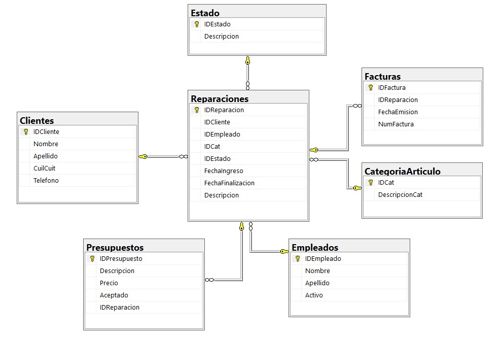

# Sistema de Gestión de Servicio Técnico (T-SQL / SQL Server)

Un sistema de base de datos relacional completamente desarrollado en T-SQL para gestionar el flujo operativo de un taller de reparación de dispositivos tecnológicos. 

Este proyecto fue diseñado con enfoque en la **integridad de los datos**, la **automatización de procesos** a nivel de servidor y el cumplimiento de **reglas de negocio**, minimizando la lógica necesaria en la capa de la aplicación.

## Tecnologías y Habilidades Demostradas

* **Motor de Base de Datos:** Microsoft SQL Server.
* **Lenguaje:** T-SQL (Transact-SQL).
* **Diseño Relacional:** Normalización, Claves Primarias/Foráneas, Constraints (`CHECK`, `DEFAULT`, `UNIQUE`).
* **Automatización y Reglas de Negocio:** Triggers (`AFTER UPDATE`, `INSTEAD OF DELETE`).
* **Programmability:** Stored Procedures, User-Defined Functions (UDFs) escalares.
* **Seguridad y Control de Concurrencia:** Manejo de Transacciones (`BEGIN TRAN`, `COMMIT`, `ROLLBACK`) y manejo de errores (`TRY/CATCH`, `RAISERROR`).
* **Análisis de Datos:** Vistas (`VIEW`) para reportes y cruce de datos.

---

## Arquitectura de la Base de Datos

El esquema centraliza la operación alrededor de la tabla `Reparaciones`, vinculando entidades clave:

* **Gestión de Usuarios:** `Clientes` y `Empleados`.
* **Catálogos:** `CategoriaArticulo` y `Estado`.
* **Operativa Financiera:** `Presupuestos` y `Facturas`.

A continuación se presenta el Diagrama de Entidad-Relación (DER) que ilustra la estructura normalizada de la base de datos, asegurando la integridad referencial entre las entidades principales.

---

##  Diccionario de Objetos, Lógica de Negocio y Automatizaciones 

La base de datos reacciona de forma autónoma a los eventos del negocio. A continuación se detalla la funcionalidad de cada objeto programado en el sistema:

###  Procedimientos Almacenados (Stored Procedures)
Manejan las operaciones críticas asegurando la consistencia mediante bloques `TRY/CATCH`.
* `sp_Insertar_Factura`: Genera una nueva factura validando estrictamente que el estado de la reparación sea 'COMPLETADO'. Si no lo es, cancela la operación lanzando una excepción controlada.
* `sp_Insertar_Presupuesto`: Registra un presupuesto dentro de una transacción. Si el nuevo presupuesto ingresa como "Aceptado", el procedimiento invalida automáticamente cualquier presupuesto anterior para esa misma reparación y actualiza el estado del equipo a 'PRESUPUESTADO'.

###  Triggers (Disparadores)
Automatizan el flujo de trabajo y protegen el historial de la base de datos.
* `TR_AsignarEmpleadoPresupuestoAceptado`: Al aceptar un presupuesto, si el equipo no tiene técnico, el trigger busca al empleado activo con la menor cantidad de reparaciones en curso y le asigna el trabajo automáticamente.
* `tr_Actualizar_Estado_Asignado`: Cuando se le asigna un técnico a un equipo por primera vez, cambia automáticamente el estado de la reparación a 'ASIGNADO'.
* `tr_Eliminar_Empleado`: Trigger del tipo `INSTEAD OF DELETE`. Intercepta cualquier intento de borrar un empleado y lo convierte en una "baja lógica" (`Activo = 0`).

###  Funciones Escalares (UDF)
* `fn_CantidadReparacionesEmpleadoXMes`: Función que recibe el ID de un empleado y un número de mes, devolviendo la cantidad exacta de reparaciones que dicho técnico finalizó en ese periodo.

###  Vistas (Views)
Preparadas para ser consumidas directamente por un Front-End o herramientas de Business Intelligence.
* `VW_Reparaciones_SinEmpleado`: Cola de trabajo que muestra los equipos ingresados pendientes de asignación técnica.
* `VW_ReparacionesEnCurso`: Listado detallado de trabajos activos (no completados) que ya cuentan con un presupuesto aprobado, mostrando cliente, técnico y monto.
* `VW_FacturacionPorCliente`: Resumen financiero que cruza facturas, clientes y presupuestos para mostrar el total facturado por operación.
* `VW_ReparacionesEmpleadoDelMes`: Utiliza la función escalar creada para listar en tiempo real la carga de reparaciones de cada técnico en el mes actual.
* `VW_CantidadReparacionesXMesDelEmpleado`: Reporte histórico agrupado que detalla el volumen de reparaciones completadas por cada empleado, segmentado por mes.
---

## Instrucciones de Despliegue

El proyecto está modularizado en 6 scripts independientes para mantener un código estructurado, escalable y fácil de mantener. 

Para desplegar la base de datos correctamente en tu entorno local, es **fundamental ejecutarlos en el siguiente orden**, ya que existen dependencias directas entre las tablas y la programación:

1. Clonar el repositorio.
2. Abrir SQL Server Management Studio (SSMS).
3. Ejecutar los scripts respetando esta secuencia:
   * `ST.sql`: Crea la base de datos `SERV_TEC_DB`, establece el Collate y genera todas las tablas con sus restricciones (PKs, FKs, CHECKs).
   * `INSERT_ST.sql`: Inserta los registros de prueba para clientes, empleados, categorías y estados.
   * `FUNCTIONS_ST.sql`: Compila las funciones escalares definidas.
   * `STORES_PROCEDURES_ST.sql`: Genera los procedimientos almacenados que manejan la lógica transaccional.
   * `TRIGGERS_ST.sql`: Implementa los disparadores encargados de las automatizaciones de estados y asignaciones de técnicos.
   * `VISTAS_ST.sql`: Crea las vistas optimizadas para la capa de reportes.

## Acerca del Proyecto y el equipo 

Este sistema fue desarrollado como proyecto integrador para la materia **Base de Datos II** de la Tecnicatura Universitaria en Programación (UTN). El objetivo fue aplicar conocimientos  de T-SQL, simulando un entorno con requerimientos reales de negocio y trabajo colaborativo.

**Equipo:**
* **Nicolas Zabala** 
* **Ezequiel Benitez** 
* **Ivan Baigorria**
* **Johannes Kalksma**

